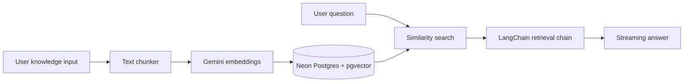

# RAG Q&A System (Next.js + LangChain + Neon + Gemini)

A full **Retrieval-Augmented Generation (RAG)** Q&A application built end-to-end with:

- **Next.js 14** (App Router)
- **LangChain** (ingestion, retrieval chain, streaming)
- **Neon Postgres** + **pgvector** (vector storage & similarity search)
- **Google Gemini** (embeddings + chat completions)

Based on Neon's official LangChain RAG starter, extended with document chunking, seed script, and a polished two-panel UI.

## Architecture



## Prerequisites

1. **Neon account** — [console.neon.tech](https://console.neon.tech)
   - Create a project and copy the Postgres connection string
   - Enable the **pgvector** extension in your database
2. **Google Gemini API key** — [aistudio.google.com/apikey](https://aistudio.google.com/apikey)
3. **Node.js 18+**

## Setup

```bash
# 1. Install dependencies
npm install

# 2. Configure environment
cp .env.example .env
# Edit .env with POSTGRES_URL and GOOGLE_API_KEY

# 3. Initialize Neon (pgvector + vector table)
npm run init-db

# 4. (Optional) Seed sample knowledge
npm run seed

# 5. Start the dev server
npm run dev
```

Open [http://localhost:3000](http://localhost:3000).

## Usage

1. **Ingest knowledge** — Paste text in the left panel and click **Save & index**, or drag/drop a file (TXT, MD, CSV, JSON, PDF, etc.). Content is chunked, embedded with Gemini, and stored in Neon.
2. **Ask questions** — Use the chat panel on the right. Answers are grounded in retrieved context from your vector store.

## API Routes

| Route | Method | Description |
|-------|--------|-------------|
| `/api/learn` | POST | Ingest text into Neon vector store |
| `/api/learn/upload` | POST | Upload a file (multipart) and index it |
| `/api/chat` | POST | Stream RAG answers from retrieved context |
| `/api/stats` | GET | Corpus chunk count, sources, config status |
| `/api/health` | GET | Database connectivity check |
| `/api/corpus` | DELETE | Clear all indexed chunks |

## Project Structure

```
app/
  api/chat/route.ts    # LangChain retrieval chain + streaming
  api/learn/route.ts   # Document ingestion endpoint
  page.tsx             # RAG playground UI
lib/
  vectorStore.ts       # NeonPostgres + Gemini embeddings
  chunker.ts           # RecursiveCharacterTextSplitter
  db.ts                # Stats, ping, clear corpus
  env.ts               # Environment validation
  llm.ts               # Gemini chat model
  rag.ts               # LangChain retrieval chain
scripts/
  init-db.ts           # Create pgvector extension + table
  seed.ts              # Seed sample Neon/LangChain knowledge
```

## Neon pgvector setup

In the Neon SQL Editor, run:

```sql
CREATE EXTENSION IF NOT EXISTS vector;
```

LangChain's `NeonPostgres.initialize()` will create the required table on first ingest.

## Gemini models

Defaults (override in `.env` if needed):

| Variable | Default |
|----------|---------|
| `GEMINI_CHAT_MODEL` | `gemini-3.6-flash` |
| `GEMINI_EMBEDDING_MODEL` | `gemini-embedding-001` |

If you previously indexed content with OpenAI embeddings, clear the corpus and re-index after switching to Gemini.

## Starter (for recording / tutorials)

[`starter/`](./starter/) mirrors this repo’s structure. The UI and helpers are complete; four backend files have TODOs to fill in live:

1. `lib/vectorStore.ts`
2. `lib/rag.ts`
3. `app/api/learn/*`
4. `app/api/chat/route.ts`

```bash
cd starter
npm install
cp .env.example .env   # POSTGRES_URL + GOOGLE_API_KEY
npm run init-db
npm run dev
```

Full answers live in `starter/.solution/`. Restore with `npm run solution:restore` inside `starter/`.

## Learn more

- [Neon AI docs](https://neon.tech/docs/ai/ai-intro)
- [LangChain + Neon guide](https://neon.tech/docs/ai/langchain)
- [Google AI Studio](https://aistudio.google.com/)
- [pgvector](https://github.com/pgvector/pgvector)
